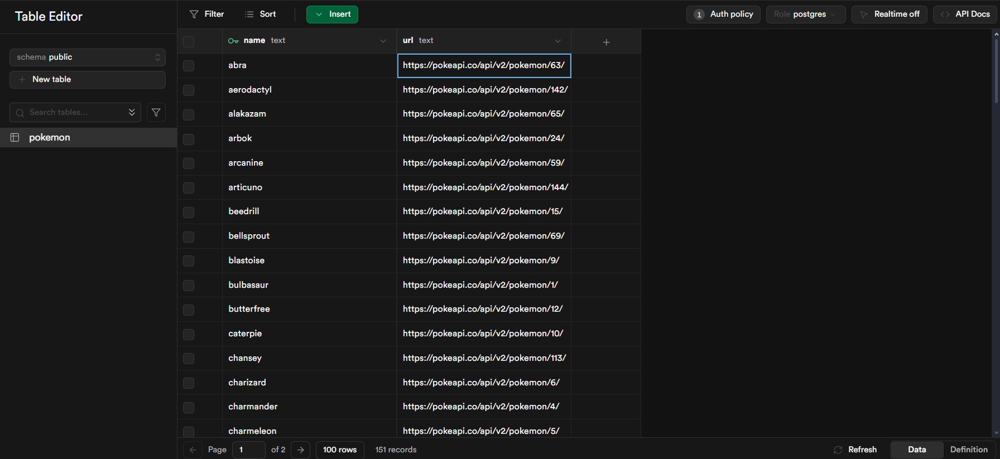
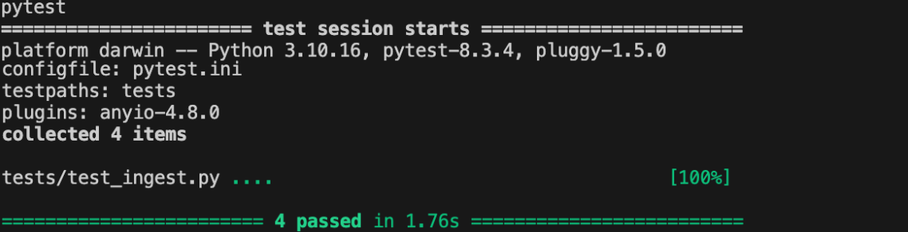

# Pacote Python para Ingestão de Dados da PokeAPI no Supabase

## Visão Geral
Este projeto implementa a ingestão de dados dos Pokémons a partir da [PokeAPI](https://pokeapi.co/) e os armazena no banco de dados do [Supabase](https://supabase.com/). O objetivo é criar um pacote Python estruturado e eficiente para coletar, processar e armazenar os dados.

## Funcionalidades Implementadas
- **Coleta de Dados**: Faz requisições à PokeAPI para obter informações dos Pokémons da Geração 1 (151 primeiros Pokémons).
- **Armazenamento**: Utiliza a API do Supabase para armazenar os dados coletados em uma tabela chamada `pokemon`.
- **Tratamento de Exceções**: Inclui mecanismos robustos para capturar erros durante as requisições HTTP e a inserção no banco.
- **Testes Automatizados**: Utiliza `pytest` para validar a funcionalidade da coleta e armazenamento dos dados.



## Estrutura do Projeto
```
data_ingestion_supabase/
├── data_ingestion/
│   ├── __init__.py
│   ├── config.py        # Configuração de credenciais do Supabase
│   ├── exceptions.py    # Definição de exceções customizadas
│   ├── ingest.py        # Módulo para coleta e armazenamento de dados
│   ├── supabase_client.py # Cliente para conexão com o Supabase
├── tests/
│   ├── test_ingest.py   # Testes para a função de ingestão
├── .env                 # Configuração de variáveis de ambiente
├── .gitignore           # Arquivos a serem ignorados pelo Git
├── README.md            # Documentação do projeto
├── setup.py             # Configuração do pacote Python
```

## Instalação e Configuração
### 1. Clone o Repositório
```bash
git clone <URL_DO_REPOSITORIO>
cd S3M11-ponderada-prog
```

### 2. Crie e configure o arquivo `.env`
Crie um arquivo `.env` na raiz do projeto e adicione suas credenciais do Supabase:
```
SUPABASE_URL=<URL_DO_SUPABASE>
SUPABASE_KEY=<CHAVE_DO_SUPABASE>
```

### 3. Instale as dependências
```bash
pip install -r requirements.txt
```

## Uso do Pacote
Para executar a ingestão de dados, utilize o seguinte comando:
```bash
python -m data_ingestion.ingest
```
O script irá:
1. Buscar os dados da PokeAPI
2. Inserir os Pokémons na tabela `pokemon` do Supabase
3. Exibir uma mensagem de sucesso com a quantidade de registros inseridos

## Testes
Os testes utilizam `pytest`. Para rodá-los:
```bash
pytest tests/
```
Os testes incluem:
- **Teste da Coleta**: Verifica se os dados são obtidos corretamente da PokeAPI
- **Teste de Falha na Coleta**: Simula uma falha na requisição HTTP
- **Teste da Ingestão no Supabase**: Garante que os dados sejam armazenados corretamente
- **Teste de Falha na Ingestão**: Simula uma falha ao inserir dados no Supabase



## Considerações Finais
Este projeto atende aos requisitos da atividade, garantindo eficiência na implementação, estrutura organizacional, tratamento de exceções e cobertura de testes adequados. As credenciais do Supabase devem ser armazenadas de forma segura no `.env`, evitando exposição inadvertida.

Caso ocorram erros, verifique:
- Conectividade com a PokeAPI
- Permissões do Supabase
- Chaves da API no `.env` corretamente configuradas

O projeto pode ser expandido para incluir mais Pokémons, dados adicionais ou visualização dos dados armazenados.

